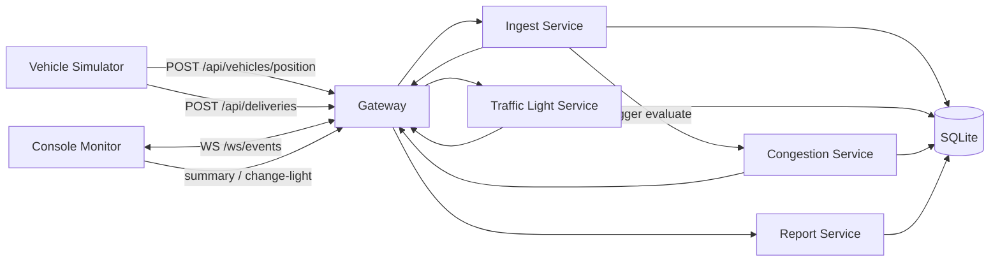

# MVTS Distributed MVP

MVP ejecutable para un **sistema distribuido mínimo** de monitoreo de tráfico en mina.

## Resumen

El proyecto modela un escenario básico de control operativo en mina donde varios servicios cooperan para:
- recibir posiciones de camiones,
- detectar congestión,
- cambiar semáforos,
- registrar entregas de material,
- generar reportes,
- y publicar eventos en tiempo real.

La implementación actual ya está separada en procesos por responsabilidad, de modo que el sistema **se presenta como arquitectura distribuida mínima**, no como un monolito único.

## Arquitectura

Servicios principales:
- **Gateway** (`app.main`) → API pública, estado agregado, WebSocket
- **Ingest service** (`app.services_ingest`) → posiciones y entregas
- **Traffic-light service** (`app.services_traffic_light`) → control de semáforos
- **Congestion service** (`app.services_congestion`) → detección de congestión
- **Report service** (`app.services_report`) → resumen y consulta de datos

Documentación de arquitectura:
- `docs/ARCHITECTURE.md`

### Diagrama rápido



## Qué incluye

- **5 servicios/procesos** con responsabilidad separada
- **Persistencia SQLite** (`data/mvts.db`)
- **WebSocket** para eventos en tiempo real
- **Simulador de vehículos**
- **Monitor por consola**
- **Validación funcional automática**
- **Script de arranque distribuido PowerShell** para Windows

## Estructura

```text
minehaul-control/
├── app/
│   ├── main.py                    # gateway / API pública
│   ├── services_ingest.py         # ingestión de posiciones y entregas
│   ├── services_traffic_light.py  # semáforos
│   ├── services_congestion.py     # detección de congestión
│   ├── services_report.py         # reportes
│   ├── gateway_state.py           # estado agregado
│   ├── congestion_runtime.py      # lógica de congestión
│   ├── models.py                  # contratos de mensajes
│   ├── service_config.py          # configuración de URLs/tokens
│   └── db.py                      # SQLite + schema
├── docs/
│   └── ARCHITECTURE.md
├── scripts/
│   ├── vehicle_simulator.py
│   ├── console_monitor.py
│   └── validate_mvp.py
├── data/
├── requirements.txt
├── start_distributed_mvp.ps1      # Windows PowerShell
├── start_distributed_mvp.sh       # script auxiliar original
├── start_mvp.sh
└── README.md
```

## Flujo distribuido MVP

1. `vehicle_simulator.py` publica posiciones al **gateway**.
2. El gateway delega la ingestión al **ingest-service**.
3. El ingest-service publica el evento al **gateway** y pide evaluación al **congestion-service**.
4. El congestion-service consulta el estado agregado del gateway, detecta congestión y persiste si aplica.
5. Los cambios de semáforos van al **traffic-light-service**, que audita y publica evento al gateway.
6. El **report-service** arma el resumen desde SQLite.
7. El **gateway** retransmite todos los eventos por WebSocket al monitor.

## Requisitos

- Python 3.11+

## Cómo ejecutarlo en Windows

### Opción recomendada: PowerShell

Desde la carpeta del proyecto:

```powershell
py -m venv .venv
.\.venv\Scripts\Activate.ps1
pip install -r requirements.txt
.\start_distributed_mvp.ps1
```

Eso:
- crea el entorno virtual,
- instala dependencias,
- levanta los servicios,
- arranca el simulador,
- abre el monitor de consola.

> Si PowerShell bloquea scripts, puedes habilitar solo la sesión actual con:

```powershell
Set-ExecutionPolicy -Scope Process -ExecutionPolicy Bypass
```

### Ejecución manual en Windows

Abre varias terminales PowerShell dentro de la carpeta del proyecto.

#### 1) Preparar entorno

```powershell
py -m venv .venv
.\.venv\Scripts\Activate.ps1
pip install -r requirements.txt
```

#### 2) Levantar servicios

Terminal 1:
```powershell
.\.venv\Scripts\Activate.ps1
python -m uvicorn app.services_traffic_light:app --host 127.0.0.1 --port 8002
```

Terminal 2:
```powershell
.\.venv\Scripts\Activate.ps1
python -m uvicorn app.services_congestion:app --host 127.0.0.1 --port 8003
```

Terminal 3:
```powershell
.\.venv\Scripts\Activate.ps1
python -m uvicorn app.services_report:app --host 127.0.0.1 --port 8004
```

Terminal 4:
```powershell
.\.venv\Scripts\Activate.ps1
python -m uvicorn app.services_ingest:app --host 127.0.0.1 --port 8001
```

Terminal 5:
```powershell
.\.venv\Scripts\Activate.ps1
python -m uvicorn app.main:app --host 127.0.0.1 --port 8000
```

#### 3) Correr simulador

Terminal 6:
```powershell
.\.venv\Scripts\Activate.ps1
python scripts\vehicle_simulator.py
```

#### 4) Abrir monitor

Terminal 7:
```powershell
.\.venv\Scripts\Activate.ps1
python scripts\console_monitor.py watch
```

## Comandos útiles del monitor

Cambiar semáforo:
```powershell
.\.venv\Scripts\Activate.ps1
python scripts\console_monitor.py change-light TL-02 GREEN --by operador-demo
```

Consultar resumen:
```powershell
.\.venv\Scripts\Activate.ps1
python scripts\console_monitor.py summary
```

## Validación funcional automática

```powershell
.\.venv\Scripts\Activate.ps1
python scripts\validate_mvp.py
```

El script:
- levanta los servicios en puertos aislados,
- usa una base SQLite de validación separada,
- arranca el simulador,
- escucha eventos WebSocket desde el gateway,
- cambia un semáforo,
- consulta resumen,
- genera `validation_evidence.json`.

## API pública mínima

Token demo requerido en header `x-api-token: mvts-demo-token` para operaciones sensibles.

- `POST /api/vehicles/position`
- `POST /api/deliveries`
- `POST /api/traffic-lights/change`
- `GET /api/reports/summary`
- `GET /api/state`
- `WS /ws/events`

## Regla de congestión MVP

Se dispara un evento `congestion.detected` cuando:
- hay 3 o más vehículos en la misma zona,
- la velocidad promedio es `<= 1.0`,
- la condición dura al menos 5 segundos.

## Limitaciones actuales

- La distribución sigue siendo **mínima**: múltiples servicios HTTP locales, no mensajería avanzada.
- La base sigue siendo **SQLite compartida** para simplificar la demo.
- No hay autenticación real de usuarios, solo token estático de demo.
- El simulador usa rutas fijas en memoria.
- No hay mapa gráfico ni UI web.
- El reporte es un resumen simple.

## Siguiente mejora natural

- evidencia visual de demo,
- documento corto de entrega,
- Docker Compose,
- observabilidad básica,
- broker/event bus si la rúbrica lo exige.
