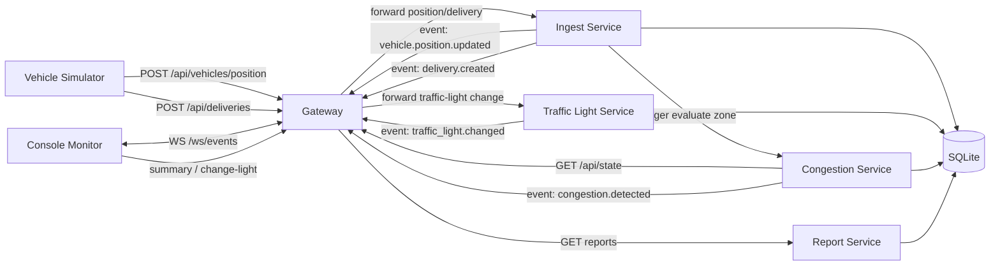

# Arquitectura - MVTS Distributed MVP

## Objetivo

Este proyecto implementa un **sistema distribuido mínimo** para monitoreo de tráfico en mina.

El sistema permite:
- recibir posiciones de vehículos,
- detectar congestión en zonas críticas,
- administrar semáforos,
- registrar entregas de material,
- generar reportes resumidos,
- publicar eventos en tiempo real para monitoreo.

## Decisión de arquitectura

Se eligió una arquitectura **multi-servicio simple por HTTP** en lugar de un monolito único.

La idea no fue construir microservicios complejos de producción, sino una separación suficiente para demostrar:
- responsabilidades independientes,
- comunicación entre procesos,
- estado agregado para monitoreo,
- persistencia común,
- validación extremo a extremo.

## Componentes

### 1. Gateway
Archivo: `app/main.py`

Responsabilidades:
- expone la API pública,
- recibe solicitudes externas,
- mantiene un estado agregado en memoria,
- retransmite eventos por WebSocket,
- actúa como punto de entrada del sistema.

### 2. Ingest Service
Archivo: `app/services_ingest.py`

Responsabilidades:
- recibir posiciones de vehículos,
- recibir entregas de material,
- persistir entregas,
- publicar eventos de posición y entrega,
- disparar evaluación de congestión.

### 3. Traffic Light Service
Archivo: `app/services_traffic_light.py`

Responsabilidades:
- administrar estados de semáforos,
- auditar cambios realizados por el operador,
- publicar eventos de cambio de semáforo.

### 4. Congestion Service
Archivo: `app/services_congestion.py`

Responsabilidades:
- consultar el estado agregado del gateway,
- evaluar congestión por zona,
- persistir eventos de congestión,
- publicar eventos cuando se detecta congestión.

### 5. Report Service
Archivo: `app/services_report.py`

Responsabilidades:
- consultar la base SQLite,
- construir el reporte resumen del sistema,
- exponer una interfaz interna de consulta.

### 6. Vehicle Simulator
Archivo: `scripts/vehicle_simulator.py`

Responsabilidades:
- simular camiones en ruta,
- generar posiciones periódicas,
- generar entregas al llegar a destino.

### 7. Console Monitor
Archivo: `scripts/console_monitor.py`

Responsabilidades:
- escuchar eventos WebSocket,
- mostrar estado inicial y cambios en tiempo real,
- permitir consulta de resumen,
- permitir cambio manual de semáforos.

## Diagrama de arquitectura

## Flujo principal

### Flujo de posiciones
1. El simulador envía una posición al gateway.
2. El gateway reenvía la solicitud al ingest service.
3. El ingest service publica un evento `vehicle.position.updated` en el gateway.
4. El gateway actualiza su estado agregado y retransmite el evento al monitor.
5. El ingest service solicita evaluación de congestión para la zona afectada.
6. El congestion service consulta el estado del gateway.
7. Si corresponde, registra un evento `congestion.detected` en SQLite y lo publica vía gateway.

### Flujo de entregas
1. El simulador envía una entrega al gateway.
2. El gateway delega al ingest service.
3. El ingest service persiste la entrega en SQLite.
4. El ingest service publica el evento `delivery.created` al gateway.
5. El gateway retransmite el evento al monitor.

### Flujo de semáforos
1. El operador ejecuta un cambio desde el monitor.
2. El gateway reenvía la orden al traffic-light service.
3. El servicio actualiza el estado y registra auditoría en SQLite.
4. El servicio publica un evento `traffic_light.changed` al gateway.
5. El gateway actualiza su estado agregado y retransmite el evento.

### Flujo de reportes
1. El operador consulta el resumen, reportes de material (día, semana, mes) o historial de congestión.
2. El gateway solicita la información al report service.
3. El report service consulta SQLite con los filtros de tiempo necesarios.
4. El resultado vuelve al operador por la API pública.

## Mecanismos de Comunicación y Seguridad

Para cumplir con los requisitos de un sistema distribuido robusto y seguro, se han elegido los siguientes mecanismos:

### 1. Comunicación: HTTP/REST y WebSockets

- **HTTP/REST (Sincrónico):** Se utiliza para la mayoría de las interacciones entre servicios (p. ej., el Gateway delegando una posición al Ingest Service). 
    - *Justificación:* Es un estándar de la industria, fácil de depurar, y permite una integración sencilla entre servicios desacoplados. Para este MVP, la latencia de HTTP es aceptable y simplifica el manejo de errores mediante códigos de estado (200, 401, 404).
- **WebSockets (Asincrónico/Tiempo Real):** Se utiliza para la difusión de eventos desde el Gateway hacia los monitores de consola.
    - *Justificación:* El requisito de "monitoreo en tiempo real" exige que el servidor pueda empujar (push) datos al cliente sin que este tenga que preguntar constantemente (polling). WebSockets mantiene una conexión abierta eficiente para este propósito.

### 2. Seguridad: Token-based Authentication (API Tokens)

- Se implementó un esquema de seguridad basado en un **Token Estático en el Header (`x-api-token`)**.
- *Justificación:* 
    - **Aislamiento:** Protege los servicios de accesos no autorizados externos.
    - **Simplicidad para MVP:** Dado que el enfoque es la arquitectura distribuida y no la gestión de identidades compleja (como OAuth2 o JWT), un token compartido demuestra el concepto de "mecanismo de seguridad adecuado" para validar que el emisor de la petición es un componente confiable del sistema.
    - **Consistencia:** Todas las llamadas inter-servicios y de la API pública requieren este token, asegurando que ningún componente quede expuesto sin validación.

### 3. Persistencia: SQLite

- Se utiliza una base de datos SQLite compartida para este MVP.
- *Justificación:* Facilita la portabilidad y ejecución inmediata del proyecto sin configurar servidores de bases de datos complejos, manteniendo la capacidad de realizar consultas SQL relacionales para los reportes gerenciales (día, semana, mes).

## Por qué sí cuenta como sistema distribuido mínimo

Este proyecto ya no es un monolito único porque:
- existen **múltiples procesos/servicios separados**,
- cada servicio tiene **una responsabilidad específica**,
- la interacción ocurre por **HTTP entre procesos**,
- el monitoreo usa **eventos WebSocket**,
- la lógica está desacoplada por componente.

Aunque corre localmente en la misma máquina, el diseño es trasladable a nodos distintos cambiando URLs y puertos.

## Validación realizada

El proyecto incluye `scripts/validate_mvp.py`, que valida automáticamente:
- arranque de servicios,
- recepción de eventos WebSocket,
- posiciones de vehículos,
- entregas,
- detección de congestión,
- cambio de semáforo,
- persistencia de datos,
- generación de resumen.

La evidencia se guarda en:
- `validation_evidence.json`

## Limitaciones del MVP

- no hay broker de mensajería,
- no hay autenticación real de usuarios,
- la persistencia está centralizada en SQLite,
- no hay tolerancia a fallos distribuida,
- no hay interfaz gráfica web,
- el simulador usa rutas predefinidas.

## Mejoras futuras

- Docker Compose para desplegar servicios separados,
- base de datos más robusta,
- broker de eventos,
- UI web operativa,
- métricas y observabilidad,
- desacoplamiento completo de persistencia por servicio.
